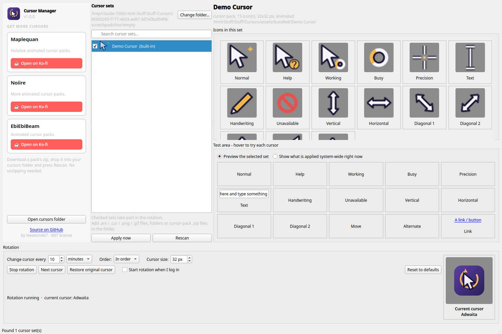

# Simple Animated Cursor Manager

A small desktop app for **Linux** that rotates your mouse cursor through a collection of
animated cursor packs, lets you preview and hover-test every icon, and can start with your
desktop. Windows `.ani` / `.cur` packs work as-is, straight from the downloaded zip.

Built and tested on **Nobara Linux** (Fedora based) with **KDE Plasma 6 on Wayland**.
It is Linux only: it produces standard Xcursor themes and switches them through Plasma's
own tools, so there is nothing to port to Windows or macOS.



## Features

- **Rotation** on a timer you choose (seconds, minutes or hours), in order or shuffled,
  with a background process that is light on memory and idle CPU.
- **Preview everything**: every icon of a set animates in a grid, and a test area lets you
  hover to try the arrow, text, busy, resize and link cursors before applying anything.
- **Any folder**: point the app at the folder where you keep your cursor packs. Zips are
  read in place, including bundles of several packs, and preview pictures are ignored.
- **Bring your own cursors**: only a simple self-drawn demo set is built in. Real packs
  belong to their artists; the sidebar links to creators whose zips drop straight in.
- **System tray**: closing the window keeps it in the tray. The tray, window and taskbar
  icon all show the cursor that is currently applied.
- **Live size control**, hotspot editing for plain images, run-at-login, and a proper
  "restore my original cursor" button.
- Shows up in System Monitor as *Cursor Manager*, not as a stray `python3`.

## Requirements

- Linux with **KDE Plasma** (5 or 6, Wayland or X11). Other desktops get a best-effort
  `gsettings` path; GTK apps follow the change, but live switching is a Plasma feature.
- **Python 3.9 or newer**. The installer checks for it and offers to install it.
- `git` to clone the repository.

## Install

```bash
git clone https://github.com/Newton667/SimpleAnimatedCursorManager-inux-.git
cd SimpleAnimatedCursorManager-inux-
./install.sh
```

`install.sh` does everything in one go:

1. Checks for Python 3.9+. If it is missing, it offers to install it with your package
   manager (`dnf`, `apt`, `pacman`, `zypper` or `apk`).
2. Creates a private virtualenv in `.venv` and installs the two dependencies there
   (PySide6 and Pillow). Nothing is installed system-wide. If your distro already ships
   them, the venv reuses them and nothing big is downloaded.
3. Adds **Cursor Manager** to your application menu and asks whether the rotation should
   start at login.

Run it again any time; it is safe to repeat. If you move the folder afterwards, run
`./install.sh` again so the menu and autostart entries point to the new place.

Prefer to do it by hand? `python3 -m venv --system-site-packages .venv`, then
`.venv/bin/pip install -r requirements.txt`, then `./cursor-manager install`.

## First start

Launch **Cursor Manager** from the application menu (or run `./cursor-manager`).
On the first start it asks **where your cursors are**: pick the folder you keep your
cursor packs in, or accept the default `Cursors_Imgs` folder inside the project. Only the
built-in demo set comes with the app, so grab a few packs from the artists linked in the
sidebar.
You can change it later with **Change folder…** at the top of the set list.

Then drop cursor packs into that folder and press **Rescan**.

| You add | What happens |
| --- | --- |
| A Windows cursor pack `.zip` (or a folder) with `.ani` / `.cur` files | One set with all icons. Roles come from the pack's `.inf`, otherwise from file names, otherwise from `_01`..`_15` numbering (the Windows scheme order). |
| A zip that contains several pack zips | One set per inner pack. Preview images inside are ignored. |
| A single `.ani` or `.cur` | A set that replaces only the arrow; the other icons come from your original theme. |
| A `.png`, `.gif`, `.webp` (up to 512 px) | Same as above. GIFs animate. Set the hotspot (click point) in the app; the red cross shows it. |

## Using it

- **Cursor sets** (middle column): search, tick the sets that should take part in the
  rotation, click one to preview it, **Apply now** to use it immediately.
- **Icons in this set**: every icon of the selected set, animating.
- **Test area**: hover the boxes to try each cursor. Switch to *Show what is applied
  system-wide right now* to check the real desktop cursor.
- **Rotation** (bottom): interval, order, cursor size, Start/Stop, Next cursor, Restore
  original cursor, run at login, Reset to defaults. The big preview on the right is the
  cursor currently applied; click it to jump to that set in the list.
- **Get more cursors** (left sidebar): links to artists who make animated cursor packs.

Closing the window keeps the app in the system tray. Left-click the tray icon to show or
hide the window; the menu has Start/Stop rotation, Next cursor, Restore original, the
cursor links and Quit. Quitting the app does **not** stop the rotation; use *Stop rotation*
for that.

**Cursor size**: 32 px shows Windows cursors at their native size at Plasma's default
cursor size. Larger values scale up (integer factors stay pixel-crisp). Changes apply
within a second or two.

## Where to get cursors

The sidebar links to these creators. Their zips drop straight into your folder:

- [Maplequan on Ko-fi](https://ko-fi.com/maplequan), whose packs this app was built and tested with.
- [Noiire's Ko-fi shop](https://ko-fi.com/noiire/shop)
- [EbiEbiBeam's Ko-fi shop](https://ko-fi.com/I3I6H9UHF/shop)

## Command line

```
./cursor-manager                 open the app        (--hidden: start in the tray)
./cursor-manager start|stop      start/stop the rotation daemon
./cursor-manager next            switch to the next set now
./cursor-manager status          what is applied, daemon state, time to next change
./cursor-manager list            all sets found in your folder
./cursor-manager folder [DIR]    show or change your cursors folder
./cursor-manager apply "Ina"     apply one set by (partial) name
./cursor-manager restore         back to your original cursor theme
./cursor-manager autostart on|off
./cursor-manager check           verify Python, dependencies and desktop tools
./cursor-manager uninstall       remove themes and menu/autostart entries (--purge: settings too)
```

## How it works

Each set is converted into a standard Xcursor theme under `~/.local/share/icons/cm-<name>/`
(pure Python, no `xcursorgen`), inheriting any missing icons from your original theme.
Switching uses `plasma-apply-cursortheme`, which Plasma pushes live to KWin and to running
apps, plus `gsettings` for GTK apps and `~/.icons/default` for old X11 programs. A few apps
(some games, older Electron builds) only read the cursor when they start.

The rotation runs as a small background process. Themes are built in a short-lived child
process so the daemon itself stays around 35 MB with no idle CPU use. Settings live in
`~/.config/cursor-manager/config.json`, state and the log in `~/.local/state/cursor-manager/`.

## Uninstall

```bash
./cursor-manager uninstall          # restores your original cursor, removes themes and entries
./cursor-manager uninstall --purge  # ...and your settings
```

Then delete the project folder. Your cursor packs folder is never touched.

## Troubleshooting

- **"Cursor Manager is not set up yet"**: run `./install.sh` (the virtualenv is missing or
  incomplete).
- **The cursor did not change in one app**: some apps only read the cursor at startup;
  restart that app.
- **Not on KDE**: the app still runs and writes the GTK/gsettings cursor setting, but live
  switching of the compositor cursor is a Plasma feature.
- **Moved the folder**: run `./install.sh` again to refresh the menu and autostart entries.

## Credits and license

Code by [Newton667](https://github.com/Newton667), released under the [MIT license](LICENSE).

The only cursor set in this repository is the built-in **Demo Cursor**, drawn from scratch
for this project (MIT). Artists' cursor packs are never included: they are the work of
their creators and most prohibit redistribution, so download them from the creators
linked above and keep them in your own cursors folder (see `THIRD_PARTY_NOTICE.md`).
The screenshot above shows only the demo set for the same reason. Thanks to those artists
for making animated cursors that are fun to use.
